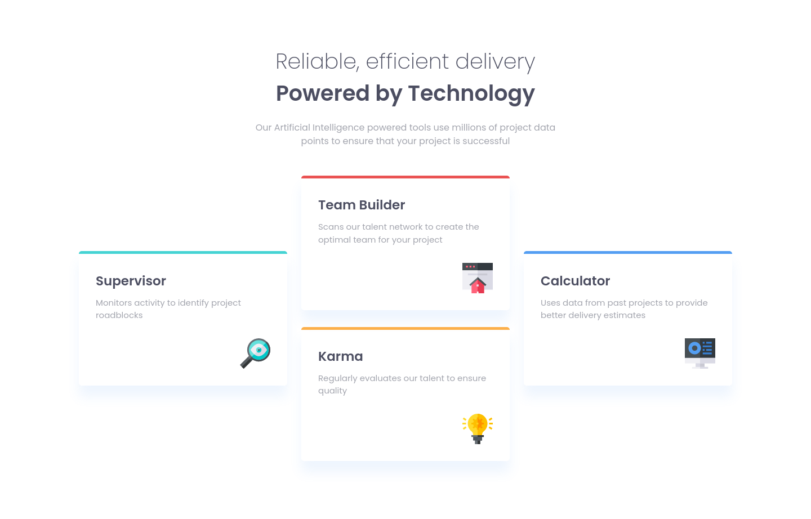
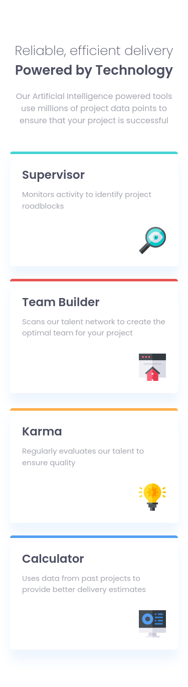

# Frontend Mentor - Four card feature section solution

This is a solution to the [Four card feature section challenge on Frontend Mentor](https://www.frontendmentor.io/challenges/four-card-feature-section-weK1eFYK). Frontend Mentor challenges help you improve your coding skills by building realistic projects. 

## Table of contents

- [Overview](#overview)
  - [The challenge](#the-challenge)
  - [Screenshot](#screenshot)
  - [Links](#links)
- [My process](#my-process)
  - [Built with](#built-with)
- [Author](#author)

## Overview

### The challenge

Users should be able to:

- View the optimal layout for the site depending on their device's screen size

### Screenshot

#### Desktop (w: 1440px, h: 922px)

#### Mobile (w: 375px, h: 1360px)

### Links

- Solution URL: [https://github.com/mochamadboval/frontend-mentor/tree/main/newbie/four-card-feature-section](https://github.com/mochamadboval/frontend-mentor/tree/main/newbie/four-card-feature-section)
- Live Site URL: [https://mochamadboval.github.io/frontend-mentor/newbie/four-card-feature-section/](https://mochamadboval.github.io/frontend-mentor/newbie/four-card-feature-section/)

## My process

### Built with

- Semantic HTML5 markup
- CSS custom properties
- CSS Flexbox

## Author

- Website - [Mochamad Boval](https://mochboval.com)
- Frontend Mentor - [@mochamadboval](https://frontendmentor.io/profile/mochamadboval)
- Twitter - [@mochamadboval](https://twitter.com/mochamadboval)
