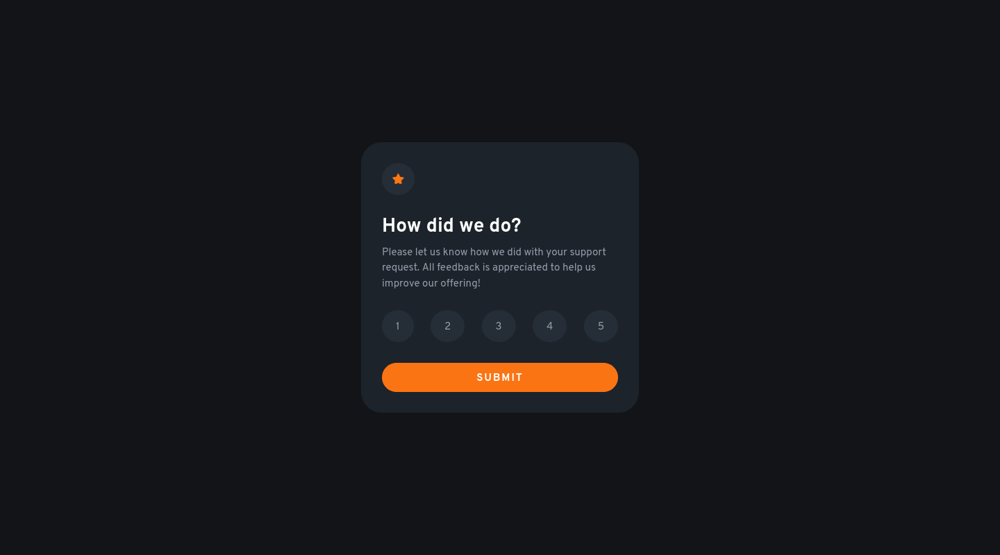
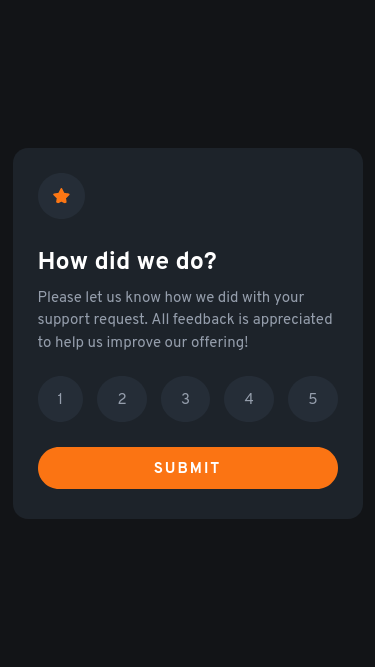

# Frontend Mentor - Interactive rating component solution

This is a solution to the [Interactive rating component challenge on Frontend Mentor](https://www.frontendmentor.io/challenges/interactive-rating-component-koxpeBUmI). Frontend Mentor challenges help you improve your coding skills by building realistic projects. 

## Table of contents

- [Overview](#overview)
  - [The challenge](#the-challenge)
  - [Screenshot](#screenshot)
  - [Links](#links)
- [My process](#my-process)
  - [Built with](#built-with)
- [Author](#author)

## Overview

### The challenge

Users should be able to:

- View the optimal layout for the app depending on their device's screen size
- See hover states for all interactive elements on the page
- Select and submit a number rating
- See the "Thank you" card state after submitting a rating

### Screenshot

#### Desktop (w: 1440px, h: 800px)

#### Mobile (w: 375px, h: 667px)

### Links

- Solution URL: [https://github.com/mochamadboval/frontend-mentor/tree/main/newbie/interactive-rating-component](https://github.com/mochamadboval/frontend-mentor/tree/main/newbie/interactive-rating-component)
- Live Site URL: [https://mochamadboval.github.io/frontend-mentor/newbie/interactive-rating-component/](https://mochamadboval.github.io/frontend-mentor/newbie/interactive-rating-component/)

## My process

### Built with

- Semantic HTML5 markup
- CSS custom properties
- CSS Flexbox
- Local Storage

## Author

- Website - [Mochamad Boval](https://mochboval.com)
- Frontend Mentor - [@mochamadboval](https://frontendmentor.io/profile/mochamadboval)
- Twitter - [@mochamadboval](https://twitter.com/mochamadboval)
