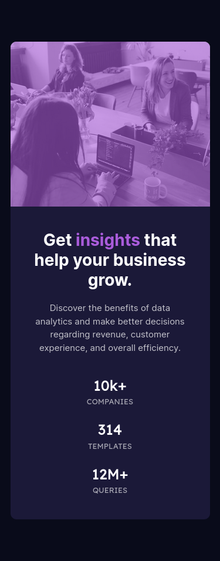

# Frontend Mentor - Stats preview card component solution

This is a solution to the [Stats preview card component challenge on Frontend Mentor](https://www.frontendmentor.io/challenges/stats-preview-card-component-8JqbgoU62). Frontend Mentor challenges help you improve your coding skills by building realistic projects. 

## Table of contents

- [Overview](#overview)
  - [The challenge](#the-challenge)
  - [Screenshot](#screenshot)
  - [Links](#links)
- [My process](#my-process)
  - [Built with](#built-with)
- [Author](#author)

## Overview

### The challenge

Users should be able to:

- View the optimal layout depending on their device's screen size

### Screenshot

#### Desktop

#### Mobile

### Links

- Solution URL: [https://github.com/mochamadboval/frontend-mentor/tree/main/newbie/stats-preview-card-component](https://github.com/mochamadboval/frontend-mentor/tree/main/newbie/stats-preview-card-component)
- Live Site URL: [https://mochamadboval.github.io/frontend-mentor/newbie/stats-preview-card-component/](https://mochamadboval.github.io/frontend-mentor/newbie/stats-preview-card-component/)

## My process

### Built with

- Semantic HTML5 markup
- CSS custom properties
- CSS Flexbox

## Author

- Website - [Mochamad Boval](https://mochboval.com)
- Frontend Mentor - [@mochamadboval](https://frontendmentor.io/profile/mochamadboval)
- Twitter - [@mochamadboval](https://twitter.com/mochamadboval)
